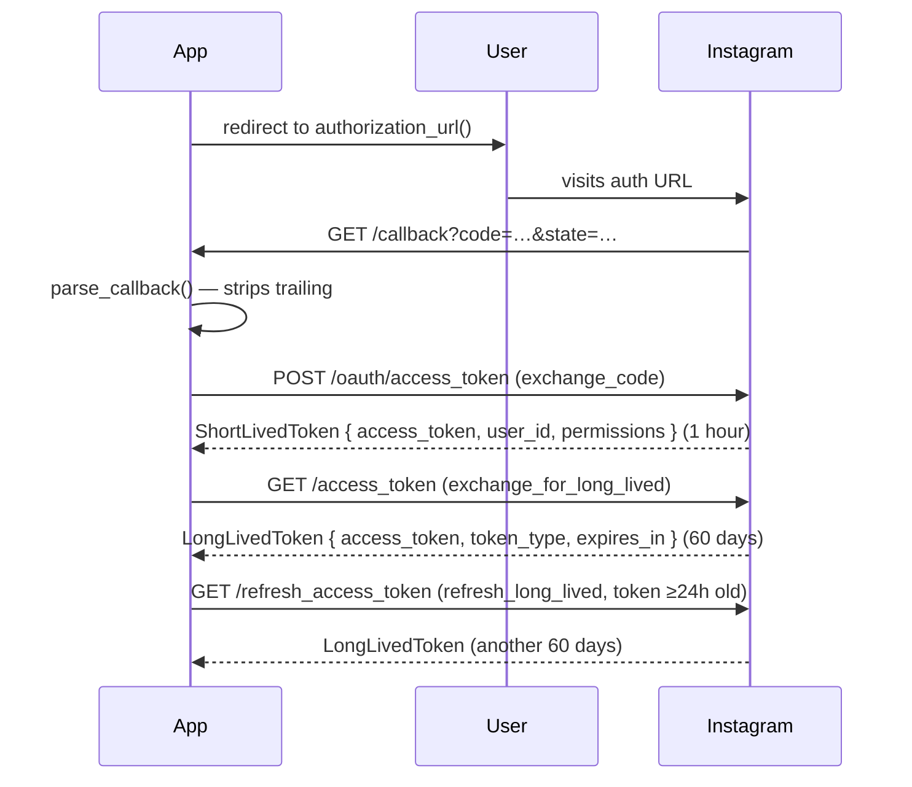

# rust-oauth2

A Cargo workspace of async-first Rust OAuth 2.0 + PKCE client libraries.

## Crates

| Crate | Description |
|---|---|
| [`x-oauth2`](./x-oauth2/) | X (Twitter) OAuth 2.0 + PKCE |
| [`tiktok-oauth2`](./tiktok-oauth2/) | TikTok LoginKit OAuth 2.0 + PKCE |
| [`instagram-oauth2`](./instagram-oauth2/) | Instagram API with Instagram Login (Business Login) |

---

## x-oauth2

X (Twitter) OAuth 2.0 Authorization Code flow with PKCE.

### Features
- Public and confidential client support
- PKCE (S256) code challenge generation
- Authorization URL construction with state parameter
- Token exchange and revocation
- HTTP Basic auth for confidential clients

### Usage

```rust
use x_oauth2::{XOAuthConfig, XOAuthClient};

// Public client (no secret)
let config = XOAuthConfig::public(
    "my_client_id",
    "https://myapp.example.com/callback",
    vec!["tweet.read", "users.read"],
);

// Confidential client
let config = XOAuthConfig::confidential(
    "my_client_id",
    "my_client_secret",
    "https://myapp.example.com/callback",
    vec!["tweet.read", "users.read"],
);

let client = XOAuthClient::new(config);

// Step 1: Generate authorization URL
let (auth_url, state, pkce) = client.authorization_url();
// Redirect user to auth_url, persist state and pkce

// Step 2: Handle callback
let params = client.parse_callback(&callback_query, &state)?;

// Step 3: Exchange code for token
let token = client.exchange_code(&params.code, &pkce).await?;
```

---

## tiktok-oauth2

TikTok LoginKit OAuth 2.0 Authorization Code flow with PKCE. You must register an app in the [TikTok Developer Portal](https://developers.tiktok.com/apps) in order to use the [Login Kit](https://developers.tiktok.com/doc/login-kit-web).

### Key Differences from x-oauth2
- Client credentials sent in POST body (not HTTP Basic auth)
- Scope separator is a comma (not space)
- Token response is wrapped in `{ data: {…}, error: {…} }` envelope
- `open_id` is returned in the token response as a stable per-user identity
- Secret is always required (no public client)

### Usage

```rust
use tiktok_oauth2::{TikTokOAuthConfig, TikTokOAuthClient};

let config = TikTokOAuthConfig::new(
    "my_client_key",
    "my_client_secret",
    "https://myapp.example.com/callback",
    vec!["user.info.basic", "video.list"],
);

let client = TikTokOAuthClient::new(config);

// Step 1: Generate authorization URL
let (auth_url, state, pkce) = client.authorization_url();

// Step 2: Handle callback
let params = client.parse_callback(&callback_query, &state)?;

// Step 3: Exchange code for token (returns TikTokTokenData with open_id)
let token = client.exchange_code(&params.code, &pkce).await?;
println!("TikTok open_id: {}", token.open_id);
```

---

## instagram-oauth2

Instagram Business Login (Instagram API with Instagram Login), supporting the mandatory two-step token exchange (short-lived → long-lived). You must register an app in the [Facebook Developer Dashboard](https://developers.facebook.com/) in order to use Instagram login.

### Token Exchange Flow



### Usage

```rust
use instagram_oauth2::{InstagramOAuthConfig, InstagramOAuthClient};

let config = InstagramOAuthConfig::new(
    "my_app_id",
    "my_app_secret",
    "https://myapp.example.com/callback",
    vec![
        "instagram_business_basic",
        "instagram_business_content_publish",
        "instagram_business_manage_messages",
        "instagram_business_manage_comments",
    ],
);

let client = InstagramOAuthClient::new(config);

// Step 1: Generate authorization URL
let (auth_url, state) = client.authorization_url();

// Step 2: Handle callback (strips trailing `#_` from code)
let params = client.parse_callback(&callback_query, &state)?;

// Step 3: Exchange code for short-lived token
let short = client.exchange_code(&params.code).await?;
println!("Instagram user_id: {}", short.user_id);

// Step 4: Exchange for long-lived token (recommended immediately)
let long = client.exchange_for_long_lived(&short.access_token).await?;

// Step 5: Refresh before expiry
let refreshed = client.refresh_long_lived(&long.access_token).await?;
```

---

## Development

```sh
# Build all crates
cargo build

# Test all crates (no network required)
cargo test --workspace

# Lint
cargo clippy --workspace

# Test a single crate
cargo test -p x-oauth2
cargo test -p tiktok-oauth2
cargo test -p instagram-oauth2

# Run the x-oauth2 example
cargo run --example oauth_flow -p x-oauth2
```

## Shared Dependencies

All crates inherit dependency versions from the workspace `Cargo.toml`:

| Dependency | Version |
|---|---|
| `reqwest` | 0.12 (json feature) |
| `tokio` | 1 (full features) |
| `serde` | 1 (derive feature) |
| `thiserror` | 1 |
| `base64` | 0.22 |
| `sha2` | 0.10 |
| `rand` | 0.8 |
| `url` | 2 |
| `mockito` | 1 |
